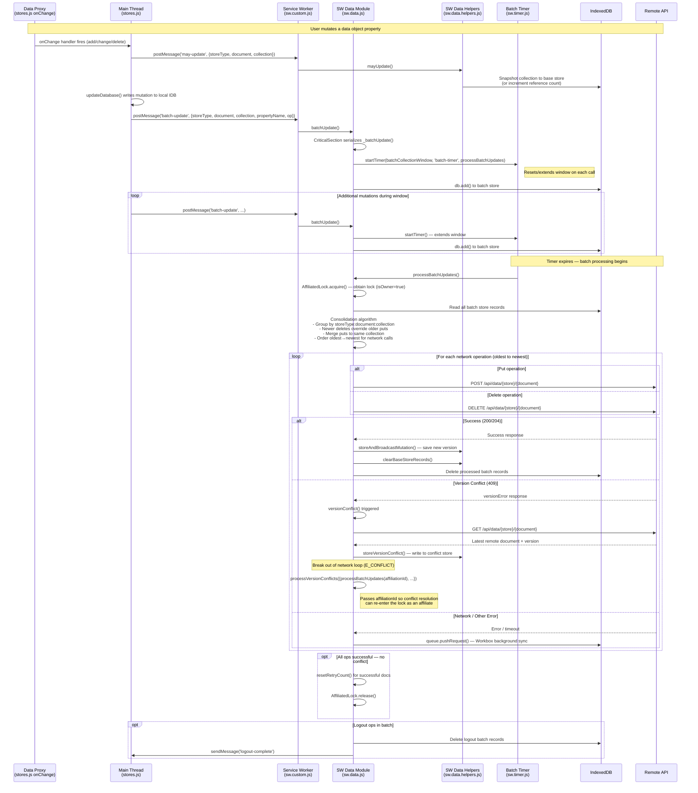

# Batch Update Processing Flow

## Overview

The Jam-Build application uses a sophisticated batching system to efficiently synchronize local data mutations with the remote API while handling offline scenarios and version conflicts. When users modify data, changes are queued and batched to minimize network requests and handle concurrent operations intelligently.

In 2.10.0, conflict retry handling became **completely asynchronous**. Prior to this release, the `processBatchUpdates → processVersionConflicts → processBatchUpdates` call chain was synchronous relative to asynchronous network operations (and recursive). Now it tries to complete this way first, but behaves differently on repeat conflicts. Repeated conflicts are resolved by an exponential backoff timer after the first attempt, with in-memory conflict sentinels and an affiliated lock (`AffiliatedLock`) introduced to coordinate ongoing re-entrant invocations with ongoing local user data changes safely.

### Key Points

* The batching window prevents chatty API calls
* The consolidation algorithm handles complex put/delete precedence rules
* The conflict resolution with 3-way merge is enterprise-grade
* Exponential backoff with jitter prevents conflict retry storms
* In-memory conflict sentinels guard against concurrent resolution of the same document
* An `AffiliatedLock` allows affiliated callers to share a lock across the async boundary
* Background sync provides offline resilience

## Quick Links

* ⛲ [Process Flow](#process-flow)
* 🔑 [Key Features](#key-features)
* ❌ [Error Handling](#error-handling)
* 📊 [Batch Updates Sequence Diagram](#batch-updates-sequence-diagram)
* 🔬 [Conflict Resolution Sequence Diagram](#conflict-resolution-sequence-diagram)

## Process Flow

1. **User Mutation** → A data object proxy in `client/main/stores.js` intercepts property changes (add, modify, delete) via an `onChange` handler.

2. **may-update message** → `queueMutation` in `stores.js` sends a `may-update` message to the service worker. The SW calls `mayUpdate` in `sw.data.helpers.js`, which snapshots the pre-mutation collection to the **base store** (or increments its reference count if a snapshot already exists). This baseline is required for 3-way merge during any subsequent conflict resolution.

3. **Local Storage** → `updateDatabase` in `stores.js` writes the mutation to the local IndexedDB object store for instant UI feedback, then sends a `batch-update` message to the service worker.

4. **Batch Queuing** → `batchUpdate` in `sw.data.js` (via `sw.custom.js` message handler) adds a record to the **batch store** in IndexedDB. Every call also resets the batch collection window timer via `startTimer`.

5. **Timer Window** → Operations are collected in a time window, extending with each new `batch-update` message. Controlled by `batchCollectionWindow` constant.

6. **Consolidation** → When the timer fires, it calls `processBatchUpdates`. The function reads all batch records and deduplicates/orders them:
    * Groups by `storeType:document:collection`
    * Newer deletes override older puts for the same data
    * Merges multiple puts to the same collection
    * Orders network calls from oldest to newest

7. **Network Sync** → Consolidated operations are sent to the remote API as `POST` (upsert) or `DELETE` calls.

8. **Conflict Resolution** → If a `409 versionError` is returned:
    * `versionConflict()` fetches the latest remote version and writes it to the **conflict store** via `storeVersionConflict()`
    * `processVersionConflicts()` is called immediately (first conflict, `retryCount === 0`)
    * `processVersionConflicts` performs a 3-way merge (base + remote + local), writes merged data to local stores, increments `retryCount` in the version store, re-queues batch operations via `conditionalBatchUpdate`, then completes:
      * **First attempt** (`retryCount === 0`): calls `completeProcessVersionConflicts` directly (synchronous path), which calls `processBatchUpdates` immediately.
      * **Subsequent attempts** (`retryCount > 0`): schedules `completeProcessVersionConflicts` on a `conflict-timer-backoff` timer with exponential backoff + jitter. `processBatchUpdates` is not called until the timer fires.
    * The `AffiliatedLock` (`alBatchUpdate`) ensures the in-progress `processBatchUpdates` invocation and the one launched from `completeProcessVersionConflicts` share lock ownership across the async boundary.
    * The conflict sentinel (`setConflictSentinel` / `isConflictSentinel`) prevents a second concurrent `processVersionConflicts` from acting on the same document while one is already in progress.

9. **Backoff Formula** → `delay = min(conflictBackoffBase * 2^retryCount, conflictBackoffMax) + random() * backoffDelay`. A telemetry beacon (`VERSION_CONFLICT_BACKOFF`) is sent on each backoff retry.

10. **Max Retries Exceeded** → If `retryCount >= conflictMaxRetries`, `failProcessVersionConflicts` is called: all conflict/batch/base records for the affected documents are purged, sentinels are cleared, retry counts are reset, remote data is force-fetched (user's local changes are lost), and an error message is shown in the UI. A final telemetry beacon is sent.

11. **Cleanup** → Successful operations remove their batch records and clear corresponding base store records. `resetRetryCount` zeros the `retryCount` for documents whose operations completed without conflict.

## Key Features

* **Offline Support**: Failed operations are queued for background sync (Workbox)
* **Multi-user Safe**: Optimistic concurrency control with 3-way merge conflict resolution
* **Performance Optimized**: Batching reduces API calls and handles burst mutations
* **Data Consistency**: 3-way merge ensures no user data is lost during conflicts; local always wins
* **Backoff Safety**: Exponential backoff with jitter prevents infinite retry loops in high-contention scenarios
* **Re-entrant Safety**: `AffiliatedLock` and conflict sentinels coordinate the async retry call chain

## Error Handling

* **Network failures** → Background sync retry queue (Workbox)
* **Version conflicts** → Automatic 3-way merge, exponential backoff retries, max retry ceiling
* **Max retries exceeded** → Force refresh from remote; user loses conflicting local changes; error shown in UI
* **API errors** → Reconciliation via `refreshData`

---

## Batch Updates Sequence Diagram

[Full Batch Updates Sequence Diagram (mermaid)](diagrams/batch-update-sequence-diagram-3.mermaid)

```mermaid
sequenceDiagram
    participant Proxy as Data Proxy<br/>(stores.js onChange)
    participant MT as Main Thread<br/>(stores.js)
    participant SW as Service Worker<br/>(sw.custom.js)
    participant SWD as SW Data Module<br/>(sw.data.js)
    participant Helpers as SW Data Helpers<br/>(sw.data.helpers.js)
    participant Timer as Batch Timer<br/>(sw.timer.js)
    participant IDB as IndexedDB
    participant API as Remote API

    Note over Proxy, API: User mutates a data object property

    Proxy->>MT: onChange handler fires (add/change/delete)
    MT->>SW: postMessage('may-update', {storeType, document, collection})
    SW->>Helpers: mayUpdate()
    Helpers->>IDB: Snapshot collection to base store<br/>(or increment reference count)

    MT->>MT: updateDatabase() writes mutation to local IDB
    MT->>SW: postMessage('batch-update', {storeType, document, collection, propertyName, op})
    SW->>SWD: batchUpdate()
    SWD->>SWD: CriticalSection serializes _batchUpdate()
    SWD->>Timer: startTimer(batchCollectionWindow, 'batch-timer', processBatchUpdates)
    Note right of Timer: Resets/extends window on each call
    SWD->>IDB: db.add() to batch store

    loop Additional mutations during window
        MT->>SW: postMessage('batch-update', ...)
        SW->>SWD: batchUpdate()
        SWD->>Timer: startTimer() — extends window
        SWD->>IDB: db.add() to batch store
    end

    Note over Timer, API: Timer expires — batch processing begins

    Timer->>SWD: processBatchUpdates()
    SWD->>SWD: AffiliatedLock.acquire() — obtain lock (isOwner=true)
    SWD->>IDB: Read all batch store records
    SWD->>SWD: Consolidation algorithm<br/>- Group by storeType:document:collection<br/>- Newer deletes override older puts<br/>- Merge puts to same collection<br/>- Order oldest→newest for network calls

    loop For each network operation (oldest to newest)
        alt Put operation
            SWD->>API: POST /api/data/{store}/{document}
        else Delete operation
            SWD->>API: DELETE /api/data/{store}/{document}
        end

        alt Success (200/204)
            API-->>SWD: Success response
            SWD->>Helpers: storeAndBroadcastMutation() — save new version
            SWD->>Helpers: clearBaseStoreRecords()
            SWD->>IDB: Delete processed batch records
        else Version Conflict (409)
            API-->>SWD: versionError response
            SWD->>SWD: versionConflict() triggered
            SWD->>API: GET /api/data/{store}/{document}
            API-->>SWD: Latest remote document + version
            SWD->>Helpers: storeVersionConflict() — write to conflict store
            Note over SWD: Break out of network loop (E_CONFLICT)
            SWD->>SWD: processVersionConflicts({processBatchUpdates(affiliationId), ...})
            Note right of SWD: Passes affiliationId so conflict resolution<br/>can re-enter the lock as an affiliate
        else Network / Other Error
            API-->>SWD: Error / timeout
            SWD->>IDB: queue.pushRequest() — Workbox background sync
        end
    end

    opt All ops successful — no conflict
        SWD->>SWD: resetRetryCount() for successful docs
        SWD->>SWD: AffiliatedLock.release()
    end

    opt Logout ops in batch
        SWD->>IDB: Delete logout batch records
        SWD->>MT: sendMessage('logout-complete')
    end
```

## Conflict Resolution Sequence Diagram

[Full Conflict Resolution Sequence Diagram (mermaid)](diagrams/conflict-resolution-diagram-2.mermaid)

```mermaid
sequenceDiagram
    participant SWD as SW Data Module<br/>(sw.data.js)
    participant Conflict as Conflict Module<br/>(sw.data.conflicts.js)
    participant Helpers as SW Data Helpers<br/>(sw.data.helpers.js)
    participant IDB as IndexedDB
    participant JsonDiff as jsondiffpatch<br/>(3-way merge)
    participant Timer as Backoff Timer<br/>(sw.timer.js)
    participant API as Remote API
    participant MT as Main Thread

    Note over SWD, MT: 409 conflict detected — versionConflict() has already fetched<br/>remote data and written it to conflict store

    SWD->>Conflict: processVersionConflicts({processBatchUpdates(affiliationId), addToBatch, refreshData})

    Conflict->>IDB: Count conflict store records — exit if 0
    Conflict->>IDB: getAll() conflict store records

    Note over Conflict: Build unique storeType+document list and versionKeys

    loop For each involved document
        Conflict->>Helpers: isConflictSentinel(storeType, document)
        alt Sentinel active (resolution already in progress)
            Conflict-->>SWD: Return immediately — deferred to next processBatchUpdates
        end
    end

    loop For each involved document
        Conflict->>Helpers: setConflictSentinel(storeType, document)
    end

    Conflict->>IDB: Read retryCount from version store for all involved docs
    Note over Conflict: maxRetryCount = max across all involved docs

    alt maxRetryCount >= conflictMaxRetries
        Conflict->>Conflict: failProcessVersionConflicts()
        Conflict->>IDB: Delete all conflict store records
        Conflict->>Helpers: clearConflictSentinel() for all docs
        Conflict->>Helpers: resetRetryCount()
        Conflict->>IDB: mayUpdate(..., clearOnly=true) — clear base store records
        Conflict->>IDB: Delete all matching batch store records
        Conflict->>API: refreshData(forceRemote=true) — fetch latest for each doc
        API-->>Conflict: Latest remote data
        Conflict->>IDB: storeData() with error message payload
        Conflict->>MT: sendMessage('database-data-update', {message: {class:'error'}})
        Note over Conflict: User's local changes are lost
    end

    Note over Conflict, JsonDiff: Build remote, local, and base data structures

    Conflict->>IDB: Iterate conflict store by version index (latest first)
    Note right of IDB: Builds remoteData[storeType][doc][col]<br/>versions[storeType][doc]<br/>batch commands, baseKeys

    loop For each storeType → document in remoteData
        Conflict->>IDB: getAllFromIndex(storeName, 'document', [scope, doc])
        Note right of IDB: Builds localData[storeType][doc][col]
    end

    loop For each baseKey [storeType, doc, col]
        Conflict->>IDB: getFromIndex(baseStoreName, 'collection', baseKey)
        Note right of IDB: Builds baseData[storeType][doc][col]
    end

    Note over Conflict, JsonDiff: 3-way merge for each storeType → doc → collection

    loop For each storeType → doc → col in localData
        Conflict->>JsonDiff: threeWayMerge(base, remote, local)
        JsonDiff->>JsonDiff: diff(base, remote) — remote changes
        JsonDiff->>JsonDiff: diff(base, local) — local changes
        alt No conflicts between remote and local diffs
            JsonDiff->>JsonDiff: Apply non-conflicting changes from both
        else Conflicting property changes
            JsonDiff->>JsonDiff: LOCAL WINS — local value overrides remote
        end
        JsonDiff-->>Conflict: Merged collection data → newData[storeType][doc][col]
    end

    Note over Conflict, IDB: Write merged data back to local stores

    loop For each storeType → doc → col in newData
        Conflict->>IDB: db.put(storeName, {scope, doc, col, merged_props})
        Note right of IDB: Collects message notification keys
    end

    Note over Conflict: Update version store with new versions and incremented retryCount

    loop For each storeType → doc → version
        Conflict->>IDB: db.put(versionStoreName, {storeType, doc, version, retryCount: maxRetryCount+1})
    end

    Note over Conflict, SWD: Re-queue batch operations for the resolved data

    loop For each batch command (put or delete)
        alt Simple string collections
            Conflict->>SWD: addToBatch({storeType, doc, op, collection})
        else Object collections with properties
            loop For each property
                Conflict->>SWD: addToBatch({storeType, doc, op, collection, propertyName})
            end
        end
    end

    Conflict->>IDB: Delete all processed conflict store records

    alt maxRetryCount === 0 — first conflict attempt
        Note over Conflict: Synchronous path — call completeProcessVersionConflicts directly
        Conflict->>Conflict: completeProcessVersionConflicts(instanceId, message, processBatchUpdates, clearSentinels)
        Conflict->>Helpers: clearConflictSentinel() for all docs
        Conflict->>SWD: processBatchUpdates(affiliationId)
        Note right of SWD: AffiliatedLock re-entry allowed via affiliationId<br/>Retries the network operations with merged data

        alt processBatchUpdates returns 0 (success)
            loop For each updated storeType
                Conflict->>MT: sendMessage('database-data-update',<br/>{message: {text:'Data synchronized...', class:'info'}})
            end
        end

    else maxRetryCount > 0 — repeat conflict, use backoff timer
        Note over Conflict: Async path — schedule via exponential backoff timer
        Conflict->>Conflict: delay = min(backoffBase * 2^retryCount, backoffMax) + jitter
        Conflict->>Conflict: resolution = computeTimerResolution(delay)
        Conflict->>Timer: startTimer(delay, 'conflict-timer-backoff',<br/>completeProcessVersionConflicts, resolution, ignoreInactivity=true)
        Note right of Timer: Timer fires after backoff delay
        Conflict->>MT: sendBeacon(VERSION_CONFLICT_BACKOFF, {retryCount, versions...})

        Note over Timer: ...backoff delay elapses...

        Timer->>Conflict: completeProcessVersionConflicts(instanceId, message, processBatchUpdates, clearSentinels)
        Conflict->>Helpers: clearConflictSentinel() for all docs
        Conflict->>SWD: processBatchUpdates(affiliationId)
        Note right of SWD: AffiliatedLock re-entry allowed via affiliationId

        alt processBatchUpdates returns 0 (success)
            loop For each updated storeType
                Conflict->>MT: sendMessage('database-data-update',<br/>{message: {text:'Data synchronized...', class:'info'}})
            end
        else Another 409 conflict
            Note over SWD, Conflict: New conflict data written to conflict store<br/>processVersionConflicts called again<br/>retryCount incremented — backoff doubles
        end
    end
```
