# Batch Update Processing Flow

The Jam-Build application uses a sophisticated batching system to efficiently synchronize local data mutations with the remote API while handling offline scenarios and version conflicts.

## Quick Links

  📊 [Batch Updates Sequence Diagram](#batch-updates-sequence-diagram)

  🔬 [Conflict Resolution Sequence Diagram](#conflict-resolution-sequence-diagram)

## Key Points

* The batching window prevents chatty API calls
* The consolidation algorithm handles complex put/delete precedence rules
* The conflict resolution with 3-way merge is enterprise-grade
* Background sync provides offline resilience

## Overview

When users modify data through the UI proxy, changes are queued and batched to minimize network requests and handle concurrent operations intelligently.

## Process Flow

1. User Mutation → Data changes trigger the proxy system in `client/main/stores.js`

2. Local Storage → Changes are immediately written to IndexedDB for instant UI feedback

3. Batch Queuing → A `batch-update` message is sent to the service worker with operation details
4. Timer Window → Operations are collected in a 67ms window (extending with each new mutation)

5. Consolidation → When the timer expires, operations are deduplicated and ordered:

    * Groups by `storeType:document:collection`
    * Newer deletes override older puts for the same data
    * Merges multiple puts to the same collection
    * Orders network calls from oldest to newest

6. Network Sync → Consolidated operations are sent to the remote API

7. Conflict Resolution → If version conflicts occur:

    * Fetches latest remote version
    * Performs 3-way merge (base + remote + local)
    * Local changes always win conflicts
    * Re-queues resolved operations and restarts batch processing

8. Cleanup → Successful operations are removed from the batch queue

## Key Features

* Offline Support: Failed operations are queued for background sync
* Multi-user Safe: Optimistic concurrency control with conflict resolution
* Performance Optimized: Batching reduces API calls and handles burst mutations
* Data Consistency: 3-way merge ensures no user data is lost during conflicts

## Error Handling

* Network failures → Background sync retry queue
* Version conflicts → Automatic 3-way merge and retry
* API errors → Reconciliation via data refresh

---

**Note:** The recursive conflict resolution currently lacks exponential backoff, which should be implemented to prevent infinite retry loops in pathological scenarios.

---

## Batch Updates Sequence Diagram

## Conflict Resolution Sequence Diagram

```mermaid
sequenceDiagram
    participant API as Remote API<br/>(Data Service)
    participant SWD as SW Data Module<br/>(sw.data.js)
    participant Conflict as Conflict Module<br/>(sw.conflicts.js)
    participant IDB as IndexedDB<br/>(Multiple Stores)
    participant JsonDiff as JsonDiffPatch<br/>(3-way merge)
    participant MT as Main Thread<br/>(UI Updates)

    Note over API, MT: Version conflict detected during batch processing

    API-->>SWD: 409 Conflict Response (versionError)
    SWD->>SWD: versionConflict() triggered
    Note right of SWD: Store metadata: {storeType, document, op, collections}

    SWD->>API: GET /api/data/{store}/{document}
    Note right of API: Retrieve latest remote version
    API-->>SWD: Return latest remote document + version

    SWD->>IDB: storeVersionConflict() - save remote data
    Note right of IDB: Store in conflict store with:<br/>- new_version<br/>- remote properties<br/>- original operation context

    SWD->>Conflict: processVersionConflicts() called
    Note right of Conflict: Begin comprehensive 3-way merge process

    Conflict->>IDB: Read all conflict store records
    Note right of IDB: Query by version index (latest first)

    loop For each conflicted document
        Conflict->>Conflict: Build remoteData structure
        Note right of Conflict: Organize by storeType -> document -> collection
        
        Conflict->>IDB: Read corresponding local data
        Note right of IDB: Get current local state from main stores
        
        Conflict->>IDB: Read base data (pre-conflict ancestor)
        Note right of IDB: Get original state from base store
    end

    Note over Conflict, JsonDiff: Perform 3-way merge for each collection

    loop For each storeType -> document -> collection
        Conflict->>JsonDiff: threeWayMerge(base, remote, local)
        
        JsonDiff->>JsonDiff: diff(base, remote) - remote changes
        JsonDiff->>JsonDiff: diff(base, local) - local changes
        
        Note right of JsonDiff: Merge Strategy:<br/>1. Apply non-conflicting changes from both<br/>2. For conflicts: LOCAL WINS over remote<br/>3. Handle arrays vs objects appropriately
        
        alt No conflicts
            JsonDiff->>JsonDiff: Apply remote changes to base
            JsonDiff->>JsonDiff: Apply local changes to base
        else Conflicting changes
            JsonDiff->>JsonDiff: Preserve local changes
            Note right of JsonDiff: Local changes override remote<br/>when same property modified
        end
        
        JsonDiff-->>Conflict: Return merged collection data
    end

    Note over Conflict, IDB: Write resolved data back to local stores

    loop For each resolved document
        Conflict->>IDB: Write merged data to main data store
        Note right of IDB: Update with conflict-resolved properties
        
        Conflict->>IDB: Update version store with new version
        Note right of IDB: Store remote version as current
    end

    Note over Conflict, SWD: Re-queue operations for resolved data

    loop For each resolved operation
        alt Simple collections (strings)
            Conflict->>SWD: addToBatch({storeType, document, op, collection})
        else Complex collections (objects with properties)
            loop For each property in collection
                Conflict->>SWD: addToBatch({...payload, collection, propertyName})
            end
        end
    end

    Conflict->>IDB: Delete processed conflict records
    Note right of IDB: Clean up temporary conflict data

    Note over Conflict, MT: Restart batch processing with resolved data

    Conflict->>SWD: Call processBatchUpdates() recursively
    Note right of SWD: ⚠️ This creates the potential infinite loop<br/>if conflicts keep occurring

    Note over SWD, MT: Notify UI of successful resolution

    loop For each updated storeType
        SWD->>MT: sendMessage('database-data-update', payload)
        Note right of MT: Includes success message:<br/>"Data was synchronized with latest version"
    end

    Note over API, MT: Conflict resolution complete - batch processing continues

    opt If more conflicts occur
        Note over SWD, Conflict: Process repeats recursively<br/>TODO: Add exponential backoff + max retries<br/>to prevent infinite loops
    end
```

