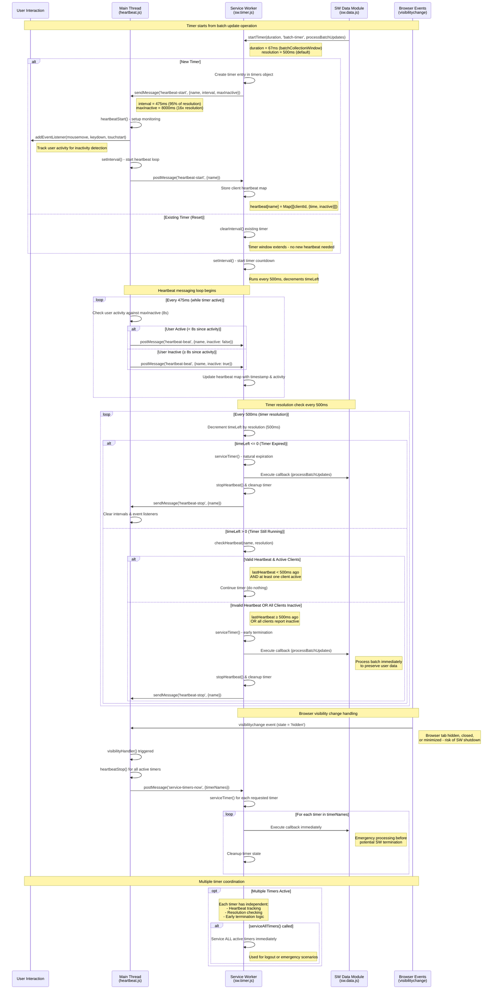

# Service Worker Timer Architecture

## Quick Links

  📊 [Jam-Build Service Worker `batch-timer` Sequence Diagram](#timer-architecture-sequence-diagram)

## Overview

Jam-Build implements a sophisticated timer system designed to overcome the inherent unreliability of timers in service workers. The architecture uses a cooperative heartbeat mechanism between the main thread and service worker to provide robust timer guarantees while gracefully handling browser resource management scenarios.

## The Problem

Service workers can be terminated unpredictably by the browser, making standard setTimeout() and setInterval() unreliable for critical operations like data synchronization. Traditional timers may never fire if the service worker is shut down, potentially causing data loss.

## The Solution

Heartbeat-Based Timer System

* Service Worker Timer (sw.timer.js): Manages timer state and countdown logic

* Main Thread Heartbeat (heartbeat.js): Monitors user activity and browser state

* Bidirectional Messaging: Coordinates between threads to ensure timer reliability

## Key Components

```javascript
// Start a timer with heartbeat monitoring
startTimer(duration, timerName, callback, resolution = 500);
```

Parameters:

* `duration`: Timer duration in milliseconds (e.g., 67ms for batch window)

* `timerName`: Unique identifier for the timer

* `callback`: Function to execute when timer completes

* `resolution`: Heartbeat check interval (default: 500ms)

## Architecture Flow

1. Timer Initialization

* Service worker creates timer entry and starts countdown

* Heartbeat begins between main thread (475ms interval) and service worker

* Main thread monitors user activity (mouse, keyboard, touch events)

2. Heartbeat Loop

```javascript
// Main thread sends activity status every 475ms
postMessage('heartbeat-beat', {
  name: timerName,
  inactive: userInactiveFor8Seconds
})
```

3. Timer Resolution (Every 500ms)
The service worker checks:

* Natural Expiration: timeLeft <= 0 → execute callback

* Heartbeat Validity: Last heartbeat < 500ms ago

* Client Activity: At least one active client exists

4. Early Termination Triggers
Timers execute immediately when:

* User Inactivity: All clients inactive for 8+ seconds

* Missing Heartbeat: No communication for 500+ ms

* Visibility Change: Browser tab hidden/closed (visibilitychange event)

## Configuration
Default Settings

* Heartbeat Interval: 475ms (95% of resolution)

* Timer Resolution: 500ms

* Inactivity Threshold: 8 seconds (16x resolution)

* Batch Window: <Varies depending on usage/purpose>

### Tuning Guidelines

* Shorter intervals: More responsive, higher CPU usage

* Longer intervals: Less CPU impact, reduced reliability

* Inactivity threshold: Balance between responsiveness and false triggers

## Usage Examples
Basic Timer

```javascript
// 67ms batch collection window
startTimer(67, 'batch-timer', processBatchUpdates);
```

## Extending Timer Window

```javascript
// Each call resets the timer duration
startTimer(67, 'batch-timer', processBatchUpdates); // starts timer
startTimer(67, 'batch-timer', processBatchUpdates); // extends window
```

## Emergency Service All Timers
```javascript
serviceAllTimers(); // Execute all pending timers immediately
```

## Browser Event Handling

### Visibility Change
```javascript
document.addEventListener('visibilitychange', () => {
  if (document.visibilityState === 'hidden') {
    // Service all timers before potential SW shutdown
    serviceAllTimers();
  }
});
```

### User Activity Monitoring
Tracks activity via:

* `mousemove`

* `keydown`

* `touchstart`

## Error Handling & Reliability

### Guarantees

✅ Data Protection: Timers execute early rather than risk data loss

✅ Graceful Degradation: System continues functioning with degraded heartbeat

✅ Multi-Client Support: Coordinates across multiple browser tabs

✅ Resource Efficiency: Optimized intervals minimize main thread impact

### Limitations

⚠️ No Absolute Guarantees: Service workers can still be terminated unexpectedly

⚠️ Network Dependencies: Assumes service worker message passing works

⚠️ Activity Detection: Limited to monitored DOM events

## Performance Considerations

### CPU Impact

* **Main Thread**: ~2ms every 475ms for heartbeat

* **Service Worker**: ~1ms every 500ms for resolution check

* **Memory**: Minimal overhead (~100 bytes per active timer)

### Network Impact

* **Zero network calls**: Pure inter-thread messaging

* **Message frequency**: ~2 messages per second during active timers

## Best Practices

* **Use Descriptive Timer Names**: Enable easier debugging and coordination

* **Handle Early Termination**: Design callbacks to be idempotent

* **Monitor Performance**: Watch for excessive timer creation/destruction

* **Test Offline Scenarios**: Verify behavior during network disruptions

* **Consider Exponential Backoff**: For retry scenarios, implement progressive delays

## Integration Notes

This timer architecture is specifically designed for Jam-Build's batch processing system but can be adapted for other service worker timing requirements. The heartbeat mechanism provides a foundation for any scenario where timer reliability is critical for data integrity.

## Timer Architecture Sequence Diagram

[Full Timer Architecture Diagram (mermaid)](diagrams/timer-architecture-diagram.mermaid)

