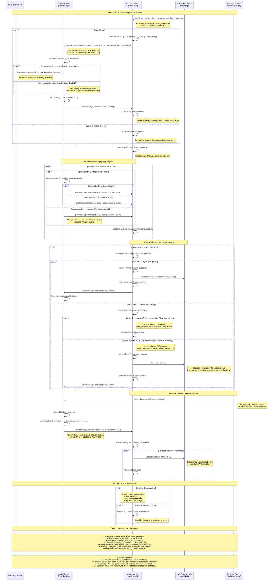

# Service Worker Timer Architecture

## Overview

Jam-Build implements a sophisticated timer system designed to overcome the inherent unreliability of timers in service workers. The architecture uses a cooperative heartbeat mechanism between the main thread and service worker to provide robust timer guarantees while gracefully handling browser resource management scenarios.

## Quick Links

* 🔑 [Key Components](#key-components)
* ⛲ [Architecture Flow](#architecture-flow)
* 🆗 [Configuration](#configuration)
* ✨ [Usage Examples](#usage-examples)
* ⏲ [Extending Timer Window](#extending-timer-window)
* ◀ [Browser Event Handling](#browser-event-handling)
* ❌ [Error Handling & Reliability](#error-handling--reliability)
* 🏆 [Performance Considerations](#performance-considerations)
* 📊 [Jam-Build Service Worker `batch-timer` Sequence Diagram](#timer-architecture-sequence-diagram)

## The Problem

Service workers can be terminated unpredictably by the browser, making standard setTimeout() and setInterval() unreliable for critical operations like data synchronization. Traditional timers may never fire if the service worker is shut down, potentially causing data loss.

## The Solution

Heartbeat-Based Timer System

* Service Worker Timer (sw.timer.js): Manages timer state and countdown logic

* Main Thread Heartbeat (heartbeat.js): Monitors user activity and browser state

* Bidirectional Messaging: Coordinates between threads to ensure timer reliability

## Key Components

```javascript
// Start a timer with heartbeat monitoring
startTimer(duration, timerName, callback, resolution = 500, ignoreInactivity = false);
```

Parameters:

* `duration`: Timer duration in milliseconds

* `timerName`: Unique identifier for the timer

* `callback`: Function to execute when timer completes

* `resolution`: Heartbeat check interval (default: 500ms)

* `ignoreInactivity`: When `true`, user idle state never triggers early termination (default: `false`)

## Architecture Flow

1. Timer Initialization

* Service worker creates timer entry and starts countdown

* Heartbeat begins between main thread and service worker

* Main thread monitors user activity (mouse, keyboard, touch events)

2. Heartbeat Loop

```javascript
// Main thread sends activity status every 475ms
postMessage('heartbeat-beat', {
  name: timerName,
  inactive: userInactiveFor8Seconds
})
```

3. Timer Resolution 
The service worker checks:

* Natural Expiration: timeLeft <= 0 → execute callback

* Heartbeat Validity: Last, shortest heartbeat < resolution

* Client Activity: At least one active client exists

4. Early Termination Triggers
Timers execute immediately when:

* **Missing Heartbeat**: No communication for the timer interval (or greater) — applies to all timers

* **User Inactivity**: All clients inactive for 8+ seconds — applies to **activity-sensitive** timers only (see [Activity-Immune Timers](#activity-immune-timers))

* **Visibility Change**: Browser tab hidden/closed (`visibilitychange` event) — applies to **all timers**, including activity-immune ones
  - Excellent [reference](https://www.igvita.com/2015/11/20/dont-lose-user-and-app-state-use-page-visibility/) on using `visibilitychange`

## Configuration
Default Settings

* Heartbeat Interval: 475ms (95% of resolution)

* Timer Resolution: 500ms

* Inactivity Threshold: 8 seconds (16x resolution)

* Batch Window: 12 seconds (this should be changed for an actual application use case)

### Tuning Guidelines

* Shorter intervals: More responsive, higher CPU usage

* Longer intervals: Less CPU impact, reduced reliability

* Inactivity threshold: Balance between responsiveness and false triggers

## Usage Examples

### Activity-Sensitive Timer (default)

```javascript
// 12s batch collection window — fires early if user goes idle
startTimer(batchCollectionWindow, 'batch-timer', processBatchUpdates);
```

### Activity-Immune Timer

Some timers must not fire early due to user inactivity. Pass `ignoreInactivity = true` as the fifth argument:

```javascript
// Exponential backoff conflict retry — must respect full delay for data integrity
// User sitting idle during a background conflict resolution should NOT abort the timer.
await startTimer(delay, 'conflict-timer-backoff',
  completeProcessVersionConflicts.bind(...),
  resolution,
  true  // ignoreInactivity
);
```

With `ignoreInactivity = true`:
- No user activity listeners (`mousemove`/`keydown`/`touchstart`) are registered on the main thread
- The periodic heartbeat always sends `inactive: false` regardless of actual user activity
- `checkHeartbeat` skips the `inactiveCount === clientCount` branch — only heartbeat freshness gates the timer
- **Visibility change (`hidden`) still services the timer immediately** — that is a process lifecycle signal (SW may be killed), not an inactivity signal, and applies to all timers

## Extending Timer Window

```javascript
// Each call resets the timer duration
startTimer(500, 'batch-timer', processBatchUpdates); // starts timer
startTimer(500, 'batch-timer', processBatchUpdates); // extends window
```

## Emergency Service All Timers
```javascript
serviceAllTimers(); // Execute all pending timers immediately
```

## Activity-Immune Timers

The `ignoreInactivity` flag introduces a semantic split between the two Jam-Build timers:

| Timer | `ignoreInactivity` | Inactivity early-fires? | Visibility-hidden fires? |
|---|---|---|---|
| `batch-timer` | `false` (default) | ✅ Yes — flush before user leaves | ✅ Yes |
| `conflict-timer-backoff` | `true` | ❌ No — retry timing is a data integrity concern | ✅ Yes |

The `visibilitychange → hidden` path is **never suppressed** for any timer. When the browser hides the page the SW may be killed imminently — servicing all timers (including `conflict-timer-backoff`) at that moment is best-effort execution before death. The `conflictStore` records are durable in IDB, so a premature fire on hide is safe.

## Browser Event Handling

### Visibility Change
```javascript
document.addEventListener('visibilitychange', () => {
  if (document.visibilityState === 'hidden') {
    // Service ALL timers (including activity-immune) before potential SW shutdown
    serviceAllTimers();
  }
});
```

### User Activity Monitoring
Tracks activity via (activity-sensitive timers only — skipped for `ignoreInactivity = true`):

* `mousemove`

* `keydown`

* `touchstart`

## Error Handling & Reliability

### Guarantees

✅ Data Protection: Timers execute early rather than risk data loss

✅ Graceful Degradation: System continues functioning with degraded heartbeat

✅ Multi-Client Support: Coordinates across multiple browser tabs

✅ Resource Efficiency: Optimized intervals minimize main thread impact

### Limitations

⚠️ No Absolute Guarantees: Service workers can still be terminated unexpectedly

⚠️ Network Dependencies: Assumes service worker message passing works

⚠️ Activity Detection: Limited to monitored DOM events

## Performance Considerations

### CPU Impact

* **Main Thread**: ~2ms every heartbeat, once per resolution period

* **Service Worker**: ~1ms for every resolution check

* **Memory**: Minimal overhead (~100 bytes per active timer)

### Network Impact

* **Zero network calls**: Pure inter-thread messaging

* **Message frequency**: 1 message per heartbeat during active timers

## Best Practices

* **Use Descriptive Timer Names**: Enable easier debugging and coordination

* **Handle Early Termination**: Design callbacks to be idempotent

* **Monitor Performance**: Watch for excessive timer creation/destruction

* **Test Offline Scenarios**: Verify behavior during network disruptions

* **Consider Exponential Backoff**: For retry scenarios, implement progressive delays

## Integration Notes

This timer architecture is specifically designed for Jam-Build's batch processing system but can be adapted for other service worker timing requirements. The heartbeat mechanism provides a foundation for any scenario where timer reliability is critical for data integrity.

## Timer Architecture Sequence Diagram

[Full Timer Architecture Diagram (mermaid)](diagrams/timer-architecture-diagram.mermaid)


```mermaid
sequenceDiagram
    participant User as User Interaction
    participant MT as Main Thread<br/>(heartbeat.js)
    participant SW as Service Worker<br/>(sw.timer.js)
    participant SWD as SW Data Module<br/>(sw.data.js)
    participant Browser as Browser Events<br/>(visibilitychange)

    Note over User, Browser: Timer starts from batch update operation

    SWD->>SW: startTimer(duration, 'batch-timer', processBatchUpdates)
    Note right of SW: duration = 12s (batchCollectionWindow)<br/>resolution = 500ms (default)

    alt New Timer
        SW->>SW: Create timer entry in timers object (store ignoreInactivity)
        SW->>MT: sendMessage('heartbeat-start', {name, interval, maxInactive, ignoreInactivity})
        Note right of MT: interval = 475ms (95% of resolution)<br/>maxInactive = 8000ms (16x resolution)
        
        MT->>MT: heartbeatStart() - setup monitoring

        alt ignoreInactivity = false (default: batch-timer)
            MT->>User: addEventListener(mousemove, keydown, touchstart)
            Note right of User: Track user activity for inactivity detection
        else ignoreInactivity = true (conflict-timer-backoff)
            Note right of MT: No activity listeners registered<br/>Heartbeat always reports inactive: false
        end
        
        MT->>MT: setInterval() - start heartbeat loop
        MT->>SW: postMessage('heartbeat-start', {name})
        
        SW->>SW: Store client heartbeat map
        Note right of SW: heartbeat[name] = Map([[clientId, {time, inactive}]])
        
    else Existing Timer (Reset)
        SW->>SW: clearInterval() existing timer
        Note right of SW: Timer window extends - no new heartbeat needed
    end

    SW->>SW: setInterval() - start timer countdown
    Note right of SW: Runs every 500ms, decrements timeLeft

    Note over MT, SW: Heartbeat messaging loop begins

    loop Every 475ms (while timer active)
        alt ignoreInactivity = false (batch-timer)
            MT->>MT: Check user activity against maxInactive (8s)
            alt User Active (< 8s since activity)
                MT->>SW: postMessage('heartbeat-beat', {name, inactive: false})
            else User Inactive (≥ 8s since activity)  
                MT->>SW: postMessage('heartbeat-beat', {name, inactive: true})
            end
        else ignoreInactivity = true (conflict-timer-backoff)
            MT->>SW: postMessage('heartbeat-beat', {name, inactive: false})
            Note right of MT: Always active — user idle state irrelevant<br/>for data integrity timers
        end
        
        SW->>SW: Update heartbeat map with timestamp & activity
    end

    Note over SW, SWD: Timer resolution check every 500ms

    loop Every 500ms (timer resolution)
        SW->>SW: Decrement timeLeft by resolution (500ms)
        
        alt timeLeft <= 0 (Timer Expired)
            SW->>SW: serviceTimer() - natural expiration
            SW->>SWD: Execute callback (processBatchUpdates)
            SW->>SW: stopHeartbeat() & cleanup timer
            SW->>MT: sendMessage('heartbeat-stop', {name})
            MT->>MT: Clear intervals & event listeners
            
        else timeLeft > 0 (Timer Still Running)
            SW->>SW: checkHeartbeat(name, resolution)
            
            alt Valid Heartbeat AND (ignoreInactivity OR active clients)
                Note right of SW: lastHeartbeat < 500ms ago<br/>AND (immune OR at least one client active)
                SW->>SW: Continue timer (do nothing)
                
            else Invalid Heartbeat OR (not immune AND all clients inactive)
                Note right of SW: lastHeartbeat ≥ 500ms ago<br/>OR (activity-sensitive AND all clients inactive)
                SW->>SW: serviceTimer() - early termination
                SW->>SWD: Execute callback
                Note right of SWD: Process immediately to preserve data<br/>(batch-timer: inactivity, backoff-timer: heartbeat lost)
                SW->>SW: stopHeartbeat() & cleanup timer
                SW->>MT: sendMessage('heartbeat-stop', {name})
            end
        end
    end

    Note over Browser, SW: Browser visibility change handling

    Browser->>MT: visibilitychange event (state = 'hidden')
    Note right of Browser: Browser tab hidden, closed,<br/>or minimized - risk of SW shutdown
    
    MT->>MT: visibilityHandler() triggered
    MT->>MT: heartbeatStop() for ALL timers (including activity-immune)
    MT->>SW: postMessage('service-timers-now', {timerNames: all})
    Note right of MT: visibilitychange is a process lifecycle signal,<br/>not inactivity — applies to ALL timers
    
    SW->>SW: serviceTimer() for each requested timer
    loop For each timer in timerNames
        SW->>SWD: Execute callback immediately
        Note right of SWD: Emergency processing before<br/>potential SW termination
        SW->>SW: Cleanup timer state
    end

    Note over User, Browser: Multiple timer coordination

    opt Multiple Timers Active
        Note over SW: Each timer has independent:<br/>- Heartbeat tracking<br/>- Resolution checking<br/>- Early termination logic
        
        alt serviceAllTimers() called
            SW->>SW: Service ALL active timers immediately
            Note right of SW: Used for logout or emergency scenarios
        end
    end

    Note over User, Browser: Timer guarantees and limitations

    rect rgb(255, 240, 240)
        Note over User, Browser: ⚠️ Service Worker Timer Reliability Challenges:<br/>• No guarantees SW won't be terminated<br/>• Heartbeat provides "best effort" continuity<br/>• Activity-sensitive timers fire early on user inactivity<br/>• Activity-immune timers ignore inactivity (ignoreInactivity=true)<br/>• Visibility changes force immediate execution for ALL timers<br/>• Multiple clients coordinate through heartbeat map
    end

    rect rgb(240, 255, 240)  
        Note over User, Browser: ✅ Design Benefits:<br/>• Data loss prevention (early termination vs lost timer)<br/>• Semantic split: batch-timer flushes on idle, backoff-timer respects full delay<br/>• Resource efficiency (longer intervals reduce main thread impact)<br/>• Coordinated shutdown (visibility changes handled gracefully for all timers)
    end
```