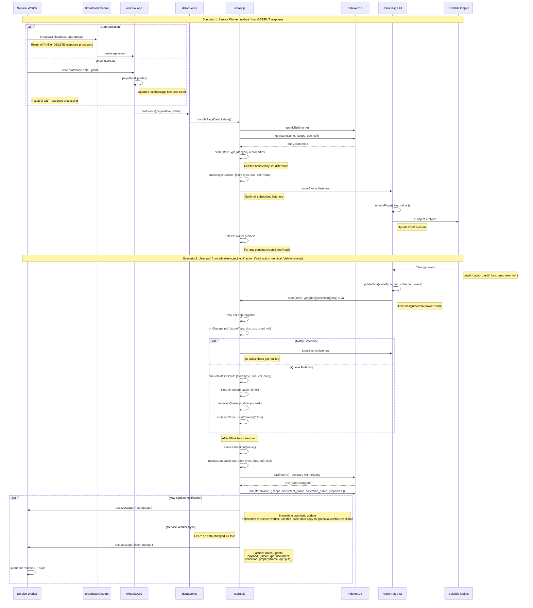

# Jam-Build Data Store Architecture

## Overview

Jam-Build implements a sophisticated data management system in the main thread that combines the simplicity of plain JavaScript objects with the power of IndexedDB persistence and reactive subscriptions. The system is built around the concept of "persistent nanostores" - lightweight, proxy-wrapped JavaScript objects that automatically sync changes to both IndexedDB and remote services through the service worker.

## Quick Links
* 🏛️ [Core Architecture](#core-architecture)
* 🎻 [Data Store Components](#data-store-components)
* 💧 [Data Flow Architecture](#data-flow-architecture)
* 🔀 [Data Flow Sequence Diagram](#data-flow-sequence-diagram)

## Core Architecture

### Persistent Nanostores Pattern

The data store implementation follows a persistent nanostore pattern that provides:

- **Plain JavaScript Objects**: Data is accessed and manipulated as regular JS objects
- **Automatic Persistence**: Changes are automatically written to IndexedDB
- **Service Worker Sync**: Mutations are batched and synchronized with remote APIs
- **Reactive Subscriptions**: Components can subscribe to data changes
- **Offline-First**: All operations work offline with automatic sync when connectivity returns

```javascript
// Simple object access and mutation
store.userStore.home.state.property1 = 'new value';
delete store.userStore.home.state.property2;

// Automatically triggers:
// 1. IndexedDB update
// 2. Service worker batch sync
// 3. UI subscription notifications
```

#### Store Structure and Data Design
A store is a series of json compliant values on a structured path.  The structure is as follows:

```javascript
// A data value is accessed with the following path:
store[storeType][document][collection][property]
```

##### `storeType` Domains and Scopes
`storeType` is an opaque string that denotes a path to a document. It contains a data domain and scope within the domain. The data domains and scopes denote separate usage and security contexts. The scheme is meant to be specific, yet flexible enough to accomodate many different application needs.  

The data domains in Jam-Build:
  * Application - Stored locally in an application document store, available remotely in separate application document, collection, property table structures.
  * User - Stored locally in a user document store, available remotely in separate user document, collection, proeprty table structures.

On the backend, data domains map to separate database structures and connection pools with different security contexts.

The data domains and scopes in the Jam-Build application reference:  
  * `app:public` - Publicly available application data
  * `user:<userid-hash>` - Private data for a specific user

The goal is flexibility to allow further application development with additional security and usage contexts on the front and back end. For example, an additional requirement might be to add the `app:user` storeType to the application to supply application data only available to all logged in users.

The authentication service allows user encryption keys to be stored for E2E data encryption (not implemented in this reference application).

##### Document, Collection, Property
The document → collection → property structure is a general data design repeated in both the application and user domains.

* Document - A named object category. A document has 1 or more collections.
* Collection - A non-ordered collection of property names and values. A collection maps to a plain javascript object. There can be empty collections.
* Property - A name of a property in a collection that has a value. A collection has zero or more properties.

The simple taxonomy allows for multiple objects in multiple named object categories. The Jam-Build reference application chooses to map "pages" to "documents" (documents are simply a named object category).

[More detail on store types, structure, and data flow](#store-types-and-structure)

## Data Store Components

### 1. Store Module (`stores.js`)

The central store module handles:

#### Store Creation and Management
```javascript
export async function createStore (storeType) {
  // Wait for service worker to populate initial data
  await new Promise(resolve => waiters[storeType] = resolve);
  
  // Create reactive proxy wrapper
  const connectedStore = new Proxy(store[storeType], createHandler([storeType]));
  return connectedStore;
}
```

#### Proxy Handler for Reactivity
```javascript
function createHandler (path = []) {
  return {
    set: (target, key, value) => {
      target[key] = value;
      onChange(opPut, [...path, key], value); // Trigger persistence and sync
      return true;
    },
    deleteProperty (target, key) {
      delete target[key];
      onChange(opDel, [...path, key], undefined); // Trigger deletion sync
      return true;
    }
  };
}
```

#### Mutation Batching System
There is a minor queue in the main thread to stage and deduplicate rapid application changes. Only effectual mutations are sent to the service worker (which are reduced and combined further using the batching algorithm).

```javascript
let mutationTimer = 0;
const mutationQueue = [];

function queueMutation (op, key) {
  clearTimeout(mutationTimer);
  
  // Add mutation to queue
  mutationQueue.push(async () => {
    const result = await updateDatabase(op, storeType, keyPath, propertyName);
    
    // Notify service worker for remote sync
    if (swActive && result) {
      swActive.postMessage({
        action: 'batch-update',
        payload: { storeType, document, collection, propertyName, op }
      });
    }
  });
  
  // Batch mutations with 67ms delay
  mutationTimer = setTimeout(serviceMutationQueue, 67);
}
```

### 2. Data Events System (`data.js`)

Handles communication between service worker and main thread:

#### Service Worker Message Handling
```javascript
window.App.add('pageDataUpdate', payload => {
  // Update request seed with new data
  const seed = JSON.parse(localStorage.getItem('seed')) || undefined;
  localStorage.setItem('seed', JSON.stringify(pageSeed(page, seed, payload)));
  
  // Fire events to store subscribers
  fireEvents('page-data-update', payload);
});
```

#### Event Subscription System
```javascript
export const dataEvents = {
  addEventListener (type, callback) {
    listeners.push({ type, callback });
  },
  removeEventListener (type, callback) {
    listeners = listeners.filter(i => !(i.type === type && i.callback === callback));
  }
};
```

### 3. Home Page Implementation (`home.js`)

Demonstrates practical usage of the store system:

#### Store Initialization
```javascript
// Setup application and user stores
store[appStoreType] = await getApplicationStore(page, appStoreType);
store[userStoreType] = await getUserStore(page, userStoreType);
```

#### UI Component Integration
```javascript
function connectEditableObject (ctrl, storeType, doc, col) {
  // Connect web component to store updates
  ctrl.addEventListener('change', updateData.bind(null, storeType, doc, col));
  
  // Update policy - only allow edits if logged in
  ctrl.onAdd = ctrl.onEdit = ctrl.onRemove = canUpdate;
}

function updateData (storeType, doc, collection, e) {
  const { detail } = e;
  const { key: prop, new: val } = detail;
  
  switch(detail.action) {
    case 'add':
    case 'edit':
      store[storeType][doc][collection][prop] = val; // Automatic sync!
      break;
    case 'remove':
      delete store[storeType][doc][collection][prop]; // Automatic sync!
      break;
  }
}
```

#### Store Event Subscriptions
```javascript
// Subscribe to store updates
storeEvents.addEventListener('update', [userStoreType, page, 'state'], updatePage);

function updatePage ({ key, value: object }) {
  const [storeType, doc, collection] = key;
  const predicate = [...storeTypeToArrayWithoutUserId(storeType), doc, collection].join('-');
  
  // Update UI element
  const el = document.getElementById(predicate);
  el.object = object;
}
```

## Data Flow Architecture

### 1. Data Request Flow
```
Page Load → updatePageData() → Service Worker → Database → 
pageDataUpdate event → Store Population → UI Update
```

### 2. Data Mutation Flow
```
User Input → Store Proxy → onChange() → queueMutation() → 
IndexedDB Update + Service Worker Message → Batch Sync → Remote API
```

### 3. Data Update Flow
```
Service Worker → 'page-data-update' event → updateStore() → 
Store Proxy → onChange('update') → UI Subscriptions → DOM Update
```

## Store Types and Structure

### Store Type Format
```javascript
// Format: "domain:scope"
const appStoreType = makeStoreType('app', 'public');
const userStoreType = makeStoreType('user', '<UserID-Hash-From-Email>');
```

### Data Hierarchy
```
Store
├── Documents (pages: home, about, contact, or any)
│   ├── Collections (content, state, settings, or any)
│   │   └── Properties (key-value pairs)
```

### Example Store Structure
```javascript
{
  "app:public": {
    "home": {
      "content": {
        "title": "Welcome",
        "intro": "This is the home page"
      },
      "state": {
        "theme": "dark",
        "layout": "grid"
      }
    }
  },
  "user:abcdef1234567890": {
    "home": {
      "state": {
        "property1": "value1",
        "property2": "value2"
      }
    }
  }
}
```

## Key Features

### 1. Automatic Document Creation
```javascript
// Automatically creates missing documents/collections
let updated = buildNewDocumentIfRequired(store, userStoreType, page, 'state');
if (updated) {
  userStateControl.object = {};
  connectEditableObject(userStateControl, userStoreType, page, 'state');
}
```

### 2. Optimistic Updates
- Changes appear immediately in UI
- Persisted to IndexedDB synchronously
- Batched for remote sync asynchronously
- Conflicts resolved through service worker merge strategies

### 3. Offline-First Operation
- All mutations work offline
- Changes queued in IndexedDB
- Automatic sync when connectivity returns
- Stale data indicators for user awareness

### 4. Multi-User Support
- User-scoped data isolation
- Role-based access control
- Admin users can edit application data
- Concurrent user conflict resolution

### 5. Performance Optimizations
- **Mutation Batching**: 67ms batching window reduces API calls
- **Change Detection**: Only syncs actual data changes using fast equality checks
- **Lazy Loading**: Stores created on-demand
- **Efficient Updates**: Granular property-level updates

## Integration Points

### Service Worker Communication
```javascript
// Main thread → Service Worker
swActive.postMessage({
  action: 'batch-update',
  payload: { storeType, document, collection, propertyName, op }
});

// Service Worker → Main thread
// GET - On remote data receipt or local fallback
sendMessage('database-data-update', payload);
// PUT/DELETE - Broadcast local data updates to other local app windows in browser context
broadcastChannel.postMessage({
  action: 'database-data-update',
  payload
});
```

### IndexedDB Integration
- Automatic schema management
- Transactional updates
- Efficient querying by compound keys
- Version-aware data handling

### UI Component Integration
- Event-driven updates
- Two-way data binding
- Permission-based editing
- Automatic DOM synchronization

## Error Handling and Edge Cases

### 1. Offline Operation
- Graceful degradation when service worker unavailable
- Local-only mode for development
- Network failure recovery

### 2. Data Conflicts
- Optimistic concurrency control
- Three-way merge resolution
- User notification of stale data
- Automatic retry mechanisms

### 3. Storage Limits
- Efficient data structures
- Garbage collection of old versions
- Storage quota monitoring

This architecture provides a powerful, yet simple-to-use data management system that seamlessly handles the complexity of offline-first, multi-user web applications while maintaining the developer experience of working with plain JavaScript objects.

### Data Flow Sequence Diagram

[full data flow sequence diagram (mermaid)](diagrams/data-flow-sequence-diagram-2.mermaid)

